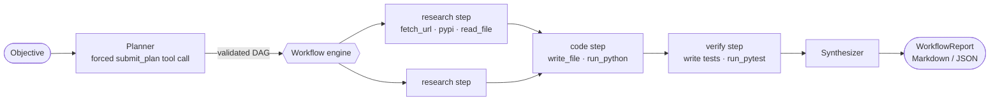

# Workflow Agent

> Prototype agent architecture that automates **multi-step technical research** and
> **code verification** with tool-calling LLMs.
>
> **Stack:** Python 3.11+ · AsyncIO · LiteLLM · Tool Calling · Pydantic v2

Workflow Agent turns an objective such as *"find out how library X handles Y, implement Z
with it, and prove it works"* into a validated plan of steps, runs independent steps in
parallel with tool-using sub-agents, and only calls something **verified** when there is
execution evidence: tests that were actually run, with their exact outcome.

Output of the offline demo (`workflow-agent demo`, no API key needed). A scripted model
drives the real tools; the files, the script run and the pytest run are all real:

```text
▶ plan (3 steps): Extract the requirements from SPEC.md, implement them, then verify the implementation independently with executed pytest tests.
   1. [research] read_spec: Extract the slugify requirements
   2. [code] implement: Implement slugify (after read_spec)
   3. [verify] verify: Verify slugify against the spec (after implement)
→ read_spec [research] started
   · step:read_spec → read_file({"path": "SPEC.md"})
✓ read_spec: success (0.0s) - Requirements from SPEC.md: 1. The result contains only lowercase ASCII letters, digits and single hyphens. …
→ implement [code] started
   · step:implement → write_file({"path": "slugify.py", "content": "\"\"\"URL slug generation (see SPEC.md).\"\"\"…)
   · step:implement → run_python({"code": "from slugify import slugify\nprint(slugify(\"Hello, Workflow Agent!\"))\n"})
✓ implement: success (0.1s) - Implemented `slugify(text, max_length=None)` in slugify.py using NFKD transliteration, …
→ verify [verify] started
   · step:verify → write_file({"path": "test_slugify.py", "content": "import pytest\n\nfrom slugify import slugify…)
   · step:verify → run_pytest({"path": "test_slugify.py"})
✓ verify: success (0.5s) - Wrote test_slugify.py (…) and ran pytest: 12 passed in 0.03s.
■ workflow success in 0.6s · 10 LLM calls · 1,200 tokens · $0.0000
```

## Highlights

| | |
|---|---|
| **Any model** | One adapter over [LiteLLM](https://github.com/BerriAI/litellm): OpenAI, Anthropic, Gemini, Bedrock, Ollama and more. Retries with jittered backoff, bounded concurrency, cost tracking. |
| **Plan → DAG → parallel execution** | The planner returns a validated DAG (cycles, unknown deps and policy violations are fed back to the model for repair). Independent steps run concurrently with `asyncio`. |
| **Evidence-based verification** | Every `code` step must be covered by a `verify` step, and a verify step that "passes" without executing anything is downgraded to `unverified`. |
| **Typed tools** | `@tool` turns any typed function into a tool. The JSON Schema comes from the signature and docstring, so schema and validation can't drift apart. Model mistakes become readable tool errors instead of crashes. |
| **Guarded execution** | Code runs in a fresh subprocess with a scrubbed environment (no API keys), rlimits, process-group kill on timeout, and bounded output. `fetch_url` blocks private, loopback and metadata addresses on every redirect hop. |
| **Budgets & observability** | Token and USD budgets, workflow timeout, typed events with a console reporter and JSONL traces. |
| **Testable by design** | `ScriptedLLMClient` makes everything deterministic: 199 tests (97% branch coverage, green on Python 3.11–3.13), plus an offline end-to-end demo that drives the real tools. |

## Quick start

```bash
git clone https://github.com/MARRY45/Workflow-Agent && cd Workflow-Agent
python -m venv .venv && source .venv/bin/activate
pip install -e ".[dev]"

# 1) No API key needed: a scripted model drives the *real* tools
#    (writes code, runs it, runs pytest) and reports the verified result.
workflow-agent demo

# 2) With a real model (any LiteLLM model id)
export OPENAI_API_KEY=sk-...
workflow-agent run "Compare httpx and aiohttp timeouts and verify your claims with code" \
    --model gpt-4o-mini --max-cost 0.25 --trace traces/run.jsonl --report report.md
```

## How it works



1. **Plan.** The planner is forced (via `tool_choice`) to call `submit_plan`, whose
   parameters are the `Plan` schema. Schema errors, dependency cycles, too many steps or
   code steps without a covering verify step are returned to the model as tool errors so it
   can repair the plan.
2. **Execute.** Each step becomes an asyncio task that awaits its dependencies, then runs a
   fresh agent limited to its kind's tools plus a terminal `complete_step` tool. A failed
   step skips only its dependents; independent branches continue.
3. **Verify.** Verify steps must execute code. Their verdict and the execution headlines
   (e.g. `run_pytest: exit code 0: all tests passed`) are recorded as evidence.
4. **Synthesize.** A final LLM call writes the answer from the step results only, flagging
   anything failed, skipped or unverified.

See [docs/ARCHITECTURE.md](docs/ARCHITECTURE.md) for the design decisions and
[docs/ROADMAP.md](docs/ROADMAP.md) for the phased delivery plan.

## CLI

```text
workflow-agent run OBJECTIVE [--mode workflow|agent] [-m MODEL] [--workspace DIR]
                             [--max-turns N] [--max-plan-steps N] [--concurrency N]
                             [--max-cost USD] [--max-tokens N] [--timeout SECONDS]
                             [--no-web] [--allow-private-network]
                             [--json] [--report FILE] [--trace FILE] [-q] [-v]
workflow-agent demo  [--workspace DIR] [--json] [--report FILE] [--trace FILE]
workflow-agent tools [--json] [--no-web]
```

* Progress goes to **stderr**; the report (Markdown, or JSON with `--json`) goes to **stdout**.
* `OBJECTIVE` may be `-` to read it from stdin.
* `--mode agent` runs a single tool-using agent loop without planning.
* Exit codes: `0` success · `1` failed or partial · `2` usage/configuration error (including a
  missing provider API key) · `130` interrupted.

## Python API

```python
import asyncio
from workflow_agent import ConsoleReporter, EventBus, Settings, build_engine

settings = Settings(model="anthropic/claude-sonnet-4-5", max_cost_usd=0.50)
engine = build_engine(settings, events=EventBus([ConsoleReporter()]))
report = asyncio.run(engine.run("Which TLS versions does Python's ssl module enable by default? Verify it."))
print(report.status, report.usage.cost_usd)
print(report.to_markdown())
```

Custom tools are plain typed functions:

```python
from typing import Annotated
from pydantic import Field
from workflow_agent import Agent, LiteLLMClient, ToolRegistry, tool

@tool(tags={"analysis"})
def word_count(text: str, unique: bool = False) -> int:
    """Count the words in a text.

    Args:
        text: The text to analyse.
        unique: Count distinct words only.
    """
    words = text.lower().split()
    return len(set(words)) if unique else len(words)

agent = Agent(LiteLLMClient("gpt-4o-mini"), ToolRegistry([word_count]))
```

More in [`examples/`](examples/).

## Built-in tools

| Tool | Tags | Purpose |
|---|---|---|
| `list_files`, `read_file` | read | Inspect the workspace |
| `write_file` | write | Create or overwrite workspace files |
| `run_python` | execution | Run a script in a sandboxed subprocess |
| `run_pytest` | execution | Run pytest on workspace tests |
| `fetch_url` | research, network | HTTP GET → readable text (HTML→text with links, JSON, paging) |
| `pypi_package_info` | research, network | Versions, metadata, dependencies and release history from PyPI |

Steps get tools by tag: `research` → research + read; `code` → read + write + execution +
research; `verify` → read + write + execution.

## Configuration

Every setting can be given as an environment variable (`WORKFLOW_AGENT_<NAME>`) or a CLI
flag. Provider credentials (`OPENAI_API_KEY`, `ANTHROPIC_API_KEY`, ...) are read by LiteLLM.
See [`.env.example`](.env.example).

| Setting | Default | Meaning |
|---|---|---|
| `MODEL` | `gpt-4o-mini` | LiteLLM model id |
| `MAX_AGENT_TURNS` | `12` | LLM calls per agent run |
| `MAX_PLAN_STEPS` | `8` | Upper bound on plan size |
| `STEP_CONCURRENCY` | `3` | Steps executed in parallel |
| `MAX_COST_USD` / `MAX_TOTAL_TOKENS` | – | Abort the run when reached |
| `WORKFLOW_TIMEOUT_S` | – | Bound on the execution phase |
| `WORKSPACE_DIR` | `./workspace` | Where tools may read, write and execute |
| `ALLOW_PRIVATE_NETWORK` | `false` | Let `fetch_url` reach private addresses |

Set `LITELLM_LOCAL_MODEL_COST_MAP=True` to stop LiteLLM from downloading its pricing table
at import time (useful offline or in CI).

## Safety model

The execution tools are **defence in depth, not a security sandbox**. They isolate the
environment (secrets are never passed to child processes), cap CPU, memory, file size,
output and wall-clock time, kill the whole process group, and confine file access to the
workspace. Treat model-generated code as untrusted: for anything beyond local
experimentation, run Workflow Agent itself inside a container or VM with restricted egress.

## Development

```bash
make check      # ruff lint + format check, mypy --strict, pytest with coverage (floor 90%)
make demo       # offline end-to-end run
pytest -m live  # real-provider smoke tests (needs WORKFLOW_AGENT_LIVE_MODEL + API key)
```

```text
src/workflow_agent/
├── llm/            # LLMClient port, LiteLLM adapter, scripted client
├── tools/          # @tool, registry, workspace, built-in tools
├── agent/          # tool-calling loop
├── workflow/       # plan models, planner, DAG engine, prompts
├── events.py       # typed run events + EventBus
├── observability.py# console reporter, JSONL traces
├── budget.py       # token/cost budgets
├── app.py          # composition root
├── demo.py         # offline end-to-end demo
└── cli.py
```

## Türkçe özet

**Workflow Agent**, çok adımlı teknik araştırma ve kod doğrulama görevlerini otomatikleştiren
bir ajan mimarisi prototipidir. Bir hedefi doğrulanmış bir adım grafiğine (DAG) böler;
birbirinden bağımsız adımları `asyncio` ile paralel çalıştırır; her adımı yalnızca kendi
türüne uygun araçlara erişen bir alt ajana verir. Bir sonucu ancak **çalıştırılmış kanıt**
(gerçekten koşturulmuş testler ve çıktıları) varsa "doğrulandı" olarak işaretler. LiteLLM
sayesinde herhangi bir model sağlayıcısıyla çalışır. Bütçe ve zaman sınırı, olay izleme
(JSONL) ve güvenli kod yürütme (ortam temizleme, kaynak limitleri, süreç grubu sonlandırma)
içerir. API anahtarı olmadan denemek için: `workflow-agent demo`.
