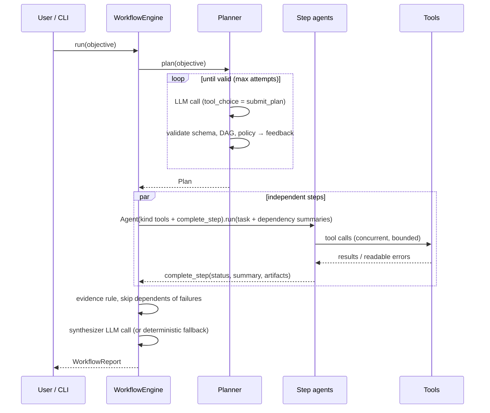

# Architecture

## Layers

Dependencies point downwards only; each layer is testable in isolation.

```text
cli.py / app.py            composition root, user interface
workflow/                  Planner, WorkflowEngine, plan/report models, prompts
agent/                     Agent: the tool-calling loop
tools/   llm/              ToolRegistry + built-ins   |   LLMClient port + adapters
messages.py events.py budget.py errors.py config.py   core types
```

| Module | Responsibility |
|---|---|
| `messages.py` | Provider-neutral `Message`, `ToolCall`, `Usage`; the only place that knows the OpenAI wire format. |
| `llm/base.py` | `LLMClient` protocol (the port). Everything above depends on it, never on LiteLLM. |
| `llm/litellm_client.py` | Adapter: lazy import, retries, concurrency limit, cost accounting, response normalization. |
| `llm/scripted.py` | Deterministic client (script or router) for tests and the offline demo. |
| `tools/base.py` | `Tool` + `@tool`: schema derived from type hints and docstrings; `$ref`s inlined. |
| `tools/registry.py` | Lookup and **safe** execution: model mistakes become error results, never exceptions. |
| `tools/workspace.py` | Path confinement (resolves symlinks, rejects `..` and absolute escapes). |
| `agent/loop.py` | Bounded turn loop, parallel tool calls, terminal tools, events, budget checks. |
| `workflow/planner.py` | Structured output via a forced tool call, validation-feedback repair loop. |
| `workflow/engine.py` | DAG scheduling, per-kind tool scoping, evidence rule, failure semantics, synthesis. |

## Run lifecycle



## Design decisions

**1. A port in front of LiteLLM.** LiteLLM gives breadth (100+ providers), but its response
objects and exceptions are not our domain types. The `LLMClient` protocol keeps the agent,
planner and engine provider-agnostic and lets `ScriptedLLMClient` stand in for any model,
which is what makes the whole system deterministic under test.

**2. Structured output through tool calling.** The planner and the step agents return
structured data through tools (`submit_plan`, `complete_step`) instead of "please answer
in JSON". The schema is enforced by the provider's tool-calling machinery and validated
again by pydantic. Validation errors become tool results the model can act on, so the
system self-repairs instead of failing. A JSON-in-text fallback covers providers that
ignore `tool_choice`.

**3. Errors are data for the model, exceptions for the program.** `ToolRegistry.execute`
turns unknown tools, malformed JSON, invalid arguments, tool exceptions and timeouts into
`ToolResult(is_error=True)` with actionable messages. Only cancellation propagates.
Provider failures (`LLMError`) and budget exhaustion are exceptions handled by the engine
with clear semantics.

**4. Terminal tools.** `complete_step` ends an agent run with validated structured output.
It must be called alone: if it arrives in the same batch as other calls it is rejected,
so the model always sees the results it is reporting on.

**5. DAG scheduling with futures, not waves.** Each step task awaits the futures of its
dependencies (shielded, so a cancelled dependent can't cancel a shared result) and then
acquires a semaphore slot. This gives maximal parallelism with no scheduler code, and
waiting tasks never hold a slot.

**6. Evidence over assertion.** Models readily claim "tests pass". A `verify` step that
completes successfully without a successful execution-tagged tool call is downgraded to
`unverified`, and the planner rejects plans whose `code` steps are not covered by a
`verify` step. The demo's integration test shows a deliberately broken implementation
passing its smoke test but failing verification.

**7. Failure isolation.** A failed step skips its dependents only. LLM errors are contained
to the step. An exhausted budget aborts the run: running steps fail at their next LLM call,
pending steps are skipped, and the report is assembled without further LLM calls.

**8. Defence-in-depth execution.** Fresh interpreter per call (`-E -s`), environment
allow-list (no secrets), rlimits applied by an in-child bootstrap (no `preexec_fn`, which
is unsafe with threads), new session plus `killpg` on timeout *and* on exit (so
background grandchildren die), exit detection that does not wait for pipes held open by
grandchildren, bounded capture, and pytest isolated from unrelated parent configuration.
This is not a security boundary; production use belongs in a container or VM.

**9. SSRF guard on every hop.** `fetch_url` follows redirects manually and resolves every
hostname, refusing non-global addresses (loopback, RFC 1918, link-local / cloud metadata,
CGNAT, IPv4-mapped IPv6). DNS rebinding between check and connect remains possible;
enforce egress rules at the network layer when it matters.

**10. Observability as events.** Every component emits typed pydantic events to an
`EventBus`. Sinks (console, JSONL trace, your own) are isolated: a failing sink is logged
and never breaks a run.

## Extension points

* **Models:** any LiteLLM model id, or implement `LLMClient` yourself.
* **Tools:** `@tool` on a typed function; tag it to make it available to step kinds
  (`WorkflowConfig.kind_tags`).
* **Policies:** `WorkflowConfig` (concurrency, turn limits, verification rule, timeout,
  kind → tag mapping) and `UsageTracker` budgets.
* **Sinks:** any callable `(Event) -> None | Awaitable[None]`.

## Known limitations (prototype)

* No context compaction: long agent runs rely on tool-output truncation and turn limits.
* The workspace is shared by concurrent steps; steps writing the same file can race.
* No persistence/resume: a run lives in memory (traces are append-only JSONL).
* No web *search* provider yet (fetching known URLs and PyPI only).
